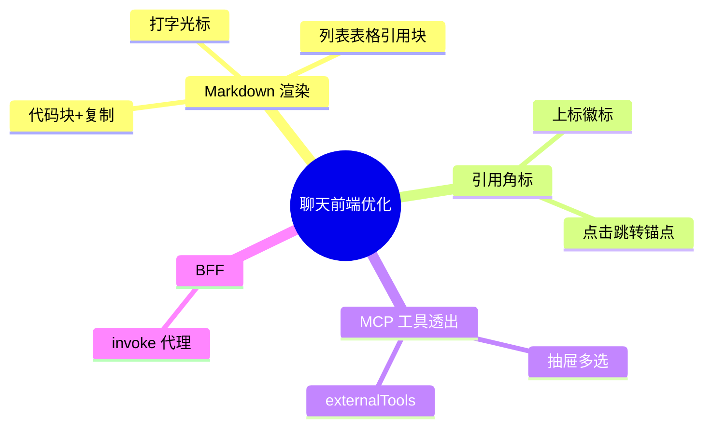

# 2026-09-20 聊天页 Markdown 渲染与 MCP 工具透出

主公，这次集中优化聊天前端：回答从"纯文本糊一团"升级为完整 Markdown 渲染，新做的 MCP 工具能力也透出到了界面。

## 1. 这次解决了什么

- **Markdown 渲染**（新组件 `markdown-answer.tsx`，react-markdown + remark-gfm）：
  - 标题/列表/加粗/表格/引用块正常渲染；
  - 代码块带语言标签 + 一键复制按钮（深色主题）；
  - 流式输出时末尾显示打字光标动画。
- **引用角标**：回答里的 `[1]` `[2]`（编号在引用范围内）渲染为上标圆角徽标，点击平滑滚动到气泡下方的引用来源 Tag（带锚点 id）；引用 Tag 也显示编号。
- **MCP 工具透出**：文档范围抽屉新增"MCP 工具"多选（内置/外部分组标注），选中的工具随请求作为 `externalTools` 传入——后端在回答前调用并把输出注入上下文。
- **BFF 补齐**：`POST /api/v1/mcp/tools/[toolName]/invoke` 代理路由。
- mock 回答模板升级为 Markdown 形态（列表+代码块+引用标记），贴近真实 LLM 输出，前端渲染验证有据可依。

## 2. 主要改动文件

- `frontend/src/components/markdown-answer.tsx`（新增）
- `frontend/src/app/(workspace)/chat/page.tsx`：气泡接入 Markdown、引用锚点、MCP 工具多选、externalTools 传参
- `frontend/src/app/globals.css`：md-answer 全套样式（代码块/角标/光标/表格）
- `frontend/src/types/rag.ts`：`AskRequest.externalTools`
- `frontend/src/app/api/v1/mcp/tools/[toolName]/invoke/route.ts`（新增 BFF）
- `python-service/scripts/mock_azure_openai.py`：Markdown 回答模板

## 3. 验证结果

- `tsc --noEmit` 与 eslint 通过（无新增告警）。
- 浏览器实测（模型指向 mock）：代码块渲染带 "PYTHON 语言标签 + 复制按钮"；有序列表正常；RAG 回答中 `[1]` 渲染为上标角标且可点击；引用来源 Tag 带编号与锚点；多轮历史正确注入（回答尾部可见"已带入N条历史"）。

## 4. 思维导图

