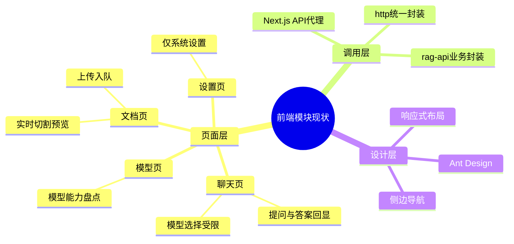

# 前端模块规划（Next.js + TypeScript + React）

主公，这里是前端总入口，先看这份再看下面的落地文档。

## 1. 当前目标

- 先把 RAG 的 5 个核心页面跑起来：聊天、文档、模型、消耗日志、设置
- 聊天必须可选模型，而且只允许选支持 chat 的在线模型
- 文档页先给上传入队 + 切割实时预览
- 前端接口先统一走 Next.js BFF，再转发给 Python
- 前端固定运行端口：`8081`

## 2. 当前目录（已落地）

```text
frontend/src/
  app/
    (workspace)/
      chat/
      documents/
      models/
      settings/
    api/v1/
      chat/ask/
      chat/ask-stream/
      documents/
        route.ts
        [documentId]/status/route.ts
        [documentId]/file/route.ts
      documents/upload/
      documents/split-preview/
      models/
  components/
    app-shell.tsx
    app-providers.tsx
  lib/
    http.ts
    rag-api.ts
  styles/
    tokens.css
  types/
    rag.ts
```

## 3. 已落地文档

- `docs/frontend/nextjs-落地规范.md`
- `docs/frontend/2026-02-28-前端初始版本落地.md`
- `docs/frontend/2026-02-28-端口调整-8081.md`
- `docs/frontend/2026-02-28-前端页面视觉重构.md`
- `docs/frontend/2026-02-28-antd-deprecated-props-修复.md`
- `docs/frontend/2026-02-28-模型管理前后端联动-前端落地.md`
- `docs/frontend/2026-02-28-token可观测性-前端落地.md`
- `docs/frontend/2026-03-01-消耗日志筛选与导出.md`
- `docs/frontend/2026-03-01-模型编辑回填修复.md`
- `docs/frontend/2026-03-01-模型编辑改为详情接口回填.md`
- `docs/frontend/2026-03-01-文档页上传记录可视化.md`
- `docs/frontend/2026-03-01-聊天流式与普通对话模式.md`
- `docs/frontend/2026-03-01-文档切分策略可选与上传提速.md`
- `docs/frontend/2026-03-01-父子文档切分策略接入.md`
- `docs/frontend/2026-03-01-pageindex切分策略接入.md`
- `docs/frontend/2026-03-01-文档管理原文预览接入.md`
- `docs/frontend/2026-03-01-模型BFF路由补齐与控制台告警修复.md`
- `docs/frontend/2026-03-01-文档分块查看交互优化.md`
- `docs/frontend/2026-03-01-聊天插件开关与MCP设置页.md`

## 4. 实现细节（大白话）

- 界面用 antd，左边固定菜单，避免“模型管理”跑到设置页里。
- 聊天页会先拉模型列表，只展示 `capabilities` 里有 `chat` 且 `status=online` 的模型。
- 聊天页现在走 SSE 流式输出；未选择文档时默认走普通对话（不触发 RAG 检索）。
- 聊天页支持插件自动调用开关和深度思考开关，结果会展示插件调用记录与深思摘要。
- 模型页现在支持新增、编辑、启停、删除，并且都是后端真实接口。
- 模型管理 BFF 路由已补齐，`/api/v1/models` 不再 404，列表/详情/状态/删除全链路可用。
- 模型配置支持录入 `Base URL` 和 `API Key`，为后续接真实模型网关预留。
- 新增“消耗日志”页面，可以查看每次 Prompt Token 消耗和每次 MCP skill 调用明细。
- 文档页支持“实时预览”开关：打开后，文本或参数变化会自动请求切割预览。
- 文档页切分策略已支持 `固定长度/按句/按段/父子分块/PageIndex` 五选一，预览和上传保持同策略。
- 文档页新增“上传任务看板”，可直接查看上传后的文档状态和任务号。
- 文档页“查看分块”已支持分页、当前页筛选、跳转指定分块号、单条复制内容。
- 文档管理已支持“预览原文”：弹窗内嵌原文件，并支持新窗口打开。
- 上传后列表刷新改为异步触发，先返回任务提示，体感速度更快。
- 设置页已接入 MCP 管理能力：可新增 Server、开关 Server、开关 Tool。
- 所有前端请求统一走 `src/lib/http.ts`，方便后续加鉴权和统一错误提示。
- 2026-02-28 做了统一视觉重构：全局设计变量、壳子布局、四大页面风格和交互已统一。

## 5. 当前思考

- 先把链路跑通比一次性做复杂功能更重要。
- BFF 先做“薄代理”，后面再补鉴权、限流、缓存。
- 页面先保证角色边界清楚，后续再做权限与多租户。

## 6. 思维导图


