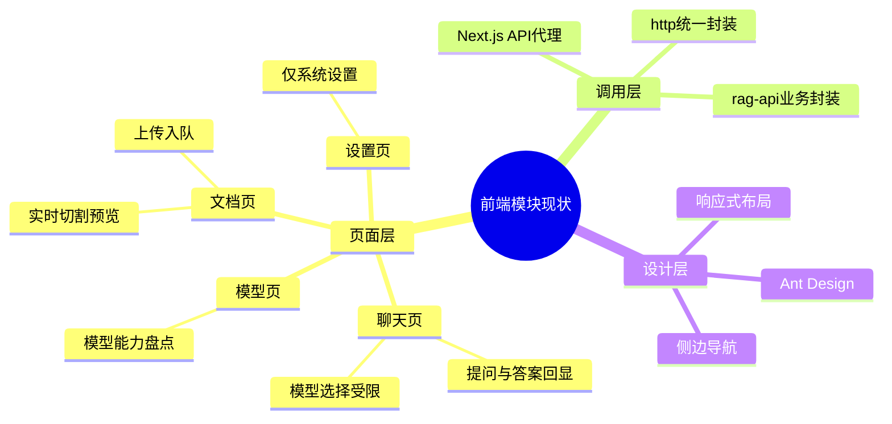

# 前端模块规划（Next.js + TypeScript + React）

主公，这里是前端总入口，先看这份再看下面的落地文档。

## 1. 当前目标

- 先把 RAG 的 4 个核心页面跑起来：聊天、文档、模型、设置
- 聊天必须可选模型，而且只允许选支持 chat 的在线模型
- 文档页先给上传入队 + 切割实时预览
- 前端接口先统一走 Next.js BFF，再转发给 Python
- 前端固定运行端口：`8081`

## 2. 当前目录（已落地）

```text
frontend/src/
  app/
    (workspace)/
      chat/
      documents/
      models/
      settings/
    api/v1/
      chat/ask/
      documents/upload/
      documents/split-preview/
      models/
  components/
    app-shell.tsx
    app-providers.tsx
  lib/
    http.ts
    rag-api.ts
  styles/
    tokens.css
  types/
    rag.ts
```

## 3. 已落地文档

- `docs/frontend/nextjs-落地规范.md`
- `docs/frontend/2026-02-28-前端初始版本落地.md`
- `docs/frontend/2026-02-28-端口调整-8081.md`
- `docs/frontend/2026-02-28-前端页面视觉重构.md`
- `docs/frontend/2026-02-28-antd-deprecated-props-修复.md`
- `docs/frontend/2026-02-28-模型管理前后端联动-前端落地.md`

## 4. 实现细节（大白话）

- 界面用 antd，左边固定菜单，避免“模型管理”跑到设置页里。
- 聊天页会先拉模型列表，只展示 `capabilities` 里有 `chat` 且 `status=online` 的模型。
- 模型页现在支持新增、编辑、启停、删除，并且都是后端真实接口。
- 模型配置支持录入 `Base URL` 和 `API Key`，为后续接真实模型网关预留。
- 文档页支持“实时预览”开关：打开后，文本或参数变化会自动请求切割预览。
- 所有前端请求统一走 `src/lib/http.ts`，方便后续加鉴权和统一错误提示。
- 2026-02-28 做了统一视觉重构：全局设计变量、壳子布局、四大页面风格和交互已统一。

## 5. 当前思考

- 先把链路跑通比一次性做复杂功能更重要。
- BFF 先做“薄代理”，后面再补鉴权、限流、缓存。
- 页面先保证角色边界清楚，后续再做权限与多租户。

## 6. 思维导图


