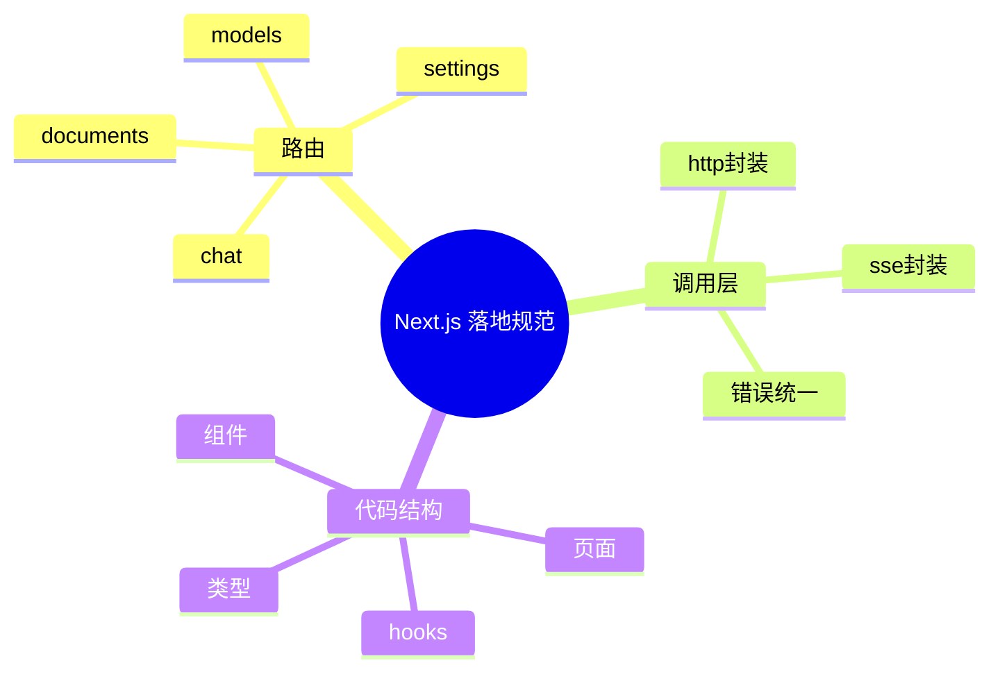

# Next.js 落地规范（前端执行手册）

## 1. 路由规范

- `/chat`：聊天主入口
- `/documents`：文档管理
- `/models`：模型管理
- `/settings`：系统设置

## 2. API 调用规范

- 统一通过 `src/lib/http.ts` 发请求
- 长连接统一封装 `src/lib/sse.ts`
- 错误统一转 UI 友好文案

## 3. 组件规范

- 页面负责布局，业务逻辑下沉到 hooks
- 可复用组件放 `src/components`
- 类型集中到 `src/types`

## 4. 样式规范

- 全局变量放 `src/styles/tokens.css`
- 页面样式按模块拆分
- 移动端优先考虑

## 5. 思维导图

