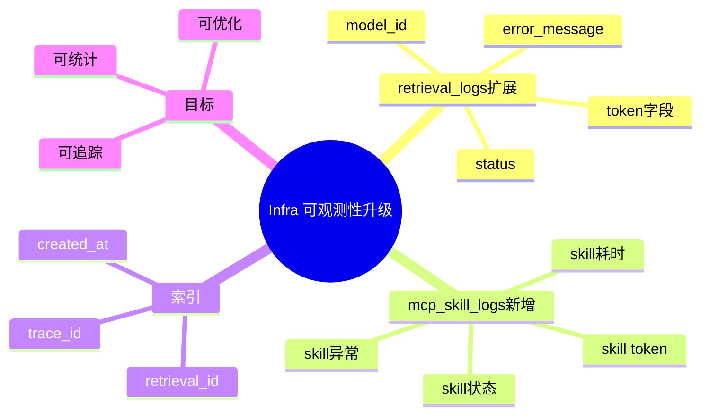

# 2026-02-28 可观测性日志表结构升级（PostgreSQL）

主公，这次基础设施层主要是 PostgreSQL 表结构升级，专门支撑 Token + MCP Skill 日志。

## 1. 改动文件

- `infra/postgres/init/001_init_schema.sql`

## 2. 升级内容

- 扩展 `retrieval_logs`
  - 新增 `model_id`
  - 新增 `prompt_tokens / completion_tokens / total_tokens`
  - 新增 `mcp_call_count`
  - 新增 `status`
  - 新增 `error_message`
- 新增 `mcp_skill_logs`
  - 通过 `retrieval_log_id` 关联主表
  - 记录 skill 名称、状态、耗时、token、输入输出摘要、异常信息
- 新增索引
  - `mcp_skill_logs(retrieval_log_id)`
  - `mcp_skill_logs(trace_id)`
  - `mcp_skill_logs(created_at DESC)`

## 3. 这样改的价值

- 能把一次问答拆成“总账 + 分账”。
- 总账看一次请求花费多少 token。
- 分账看每个 skill 的耗时和失败点。

## 4. 注意点

- 初始化 SQL 只在数据库首次创建时自动执行。
- 老数据库要依赖后端启动时的 `ALTER TABLE IF NOT EXISTS` 兜底逻辑补齐字段。

## 5. 思维导图

