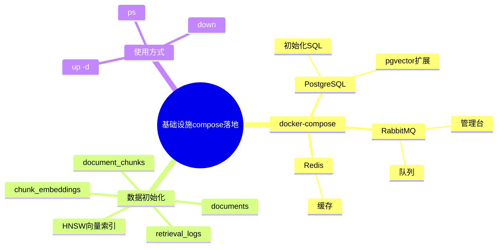

# 2026-02-28 基础设施落地：PostgreSQL+pgvector、Redis、RabbitMQ

## 1. 这次做了什么

主公，小赵这次先把项目需要的三个中间件落地成一套 `docker-compose`，本地一条命令就能起：

1. PostgreSQL（带 `pgvector` 扩展）
2. Redis
3. RabbitMQ（含管理台）

同时把 PostgreSQL 的初始化脚本也补上了，容器首次启动就会建好核心表和向量索引。

## 2. 文件落点

1. 编排文件：`docker-compose.yml`
2. PostgreSQL 初始化脚本：`infra/postgres/init/001_init_schema.sql`

## 3. 启动方式

在项目根目录执行：

```bash
docker compose up -d
```

查看状态：

```bash
docker compose ps
```

停止并保留数据卷：

```bash
docker compose down
```

## 4. 默认端口与账号

1. PostgreSQL
   - 端口：`5432`
   - DB：`rag_demo`
   - 用户：`rag_user`
   - 密码：`rag_pass`
2. Redis
   - 端口：`6379`
3. RabbitMQ
   - AMQP 端口：`5672`
   - 管理台：`http://localhost:15672`
   - 用户：`rag`
   - 密码：`rag_pass`

> 这些值都支持通过环境变量覆盖（`docker-compose.yml` 里已写 `${VAR:-默认值}`）。

## 5. PostgreSQL 初始化内容（首次启动自动执行）

`001_init_schema.sql` 做了这些事：

1. 启用扩展：`vector`、`pgcrypto`
2. 建表：
   - `documents`
   - `document_chunks`
   - `chunk_embeddings`
   - `retrieval_logs`
3. 建索引：
   - 常规状态/时间/关联索引
   - 向量索引：`HNSW + vector_cosine_ops`

## 6. 小赵的思考

1. 先把中间件和基础 schema 稳定住，后端业务接入时就不会“边接边改基础设施”。
2. 先用 `HNSW` 向量索引，适合当前阶段快速验证检索链路。
3. RabbitMQ 先起管理版镜像，后续排查队列问题更直观。

## 7. 思维导图


