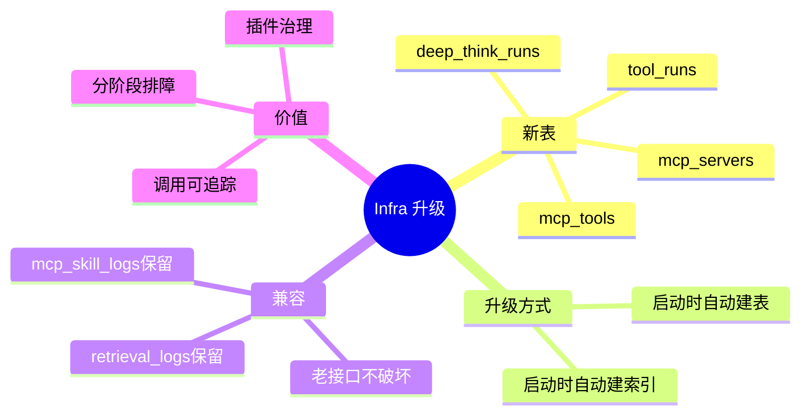

# 2026-03-01 MCP 与深度思考表结构升级

主公，这次基础设施层的重点是“新增可观测表，不破坏旧链路”。

## 1. 新增了哪些表

- `mcp_servers`：外部 MCP Server 配置
- `mcp_tools`：工具注册表（内置/外部）
- `tool_runs`：每次工具调用明细
- `deep_think_runs`：深度思考阶段明细

## 2. 为什么这样做

- 老表 `retrieval_logs/mcp_skill_logs` 更像“总账”。
- 新表是“流水账”：
  - 可以看某一步工具输入输出
  - 可以看深思每个阶段状态
- 这样排错时不用只盯 token 总数。

## 3. 升级方式

- 不是单独跑 SQL 脚本，是在服务启动时由 `database.py` 自动兜底：
  - `CREATE TABLE IF NOT EXISTS`
  - `CREATE INDEX IF NOT EXISTS`
- 老环境重启后自动补齐，不需要停机迁移。

## 4. 兼容性

- 原有接口和页面不会因为新表失效。
- 新功能只是“加法”，不是改旧字段。

## 5. 思维导图

