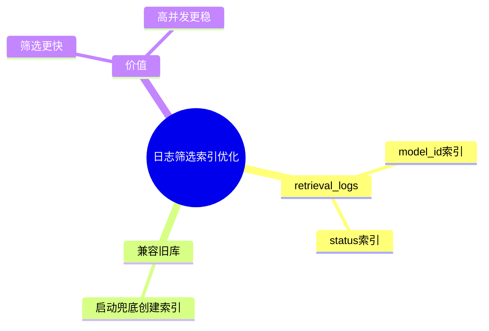

# 2026-03-01 可观测日志筛选索引优化（Infra）

主公，这次 infra 层补的是日志筛选性能优化，核心是给 `retrieval_logs` 加筛选索引。

## 1. 改动内容

- 文件：`infra/postgres/init/001_init_schema.sql`
  - 新增索引：
    - `idx_retrieval_logs_model_id`
    - `idx_retrieval_logs_status`
- 文件：`python-service/app/core/database.py`
  - 启动时 schema 兜底也会创建上面两个索引，兼容老库。

## 2. 为什么要加

- 现在消耗日志支持按 `modelId`、`status` 筛选。
- 不加索引时，日志表变大后筛选会越来越慢。

## 3. 小赵思考

- 先加最直接的单列索引，性价比高。
- 后续如果查询模式固定（比如常按 `status + created_at`），再考虑组合索引。

## 4. 思维导图

