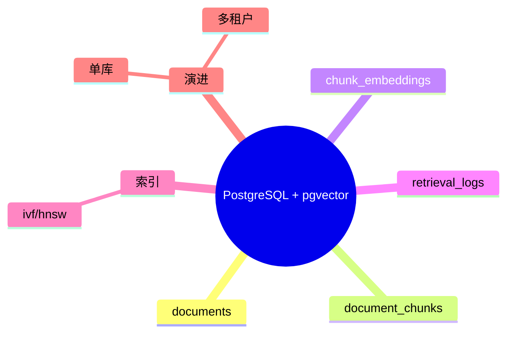

# PostgreSQL + pgvector 规划

## 1. 要存什么

- 文档表 `documents`
- chunk 表 `document_chunks`
- 向量表 `chunk_embeddings`
- 检索日志 `retrieval_logs`

## 2. 关键点

- `chunk_embeddings.vector` 用 pgvector 类型
- 先用 IVF/HNSW 索引做相似检索
- chunk 表必须保留来源位置信息，方便引用展示

## 3. 版本策略

- V1：单库单 schema
- V2：按租户或业务线拆 schema

## 思维导图

