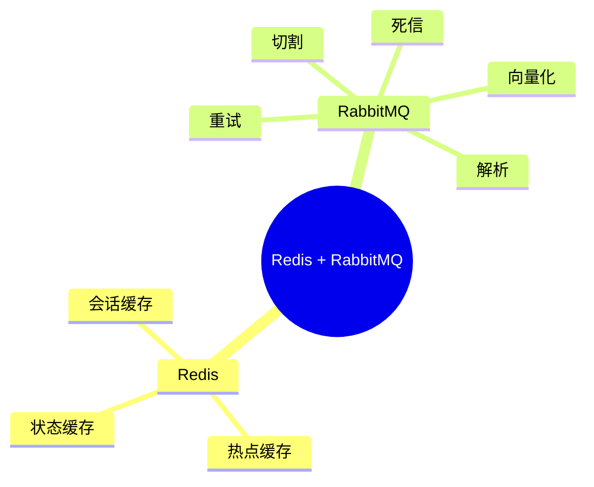

# Redis + RabbitMQ 规划

## 1. Redis 用途

- 会话上下文缓存
- 热问答缓存
- 任务短状态缓存

## 2. RabbitMQ 用途

- 文档解析队列
- 切割队列
- 向量化队列
- 重试队列
- 死信队列

## 3. 最小规则

- 任务必须幂等
- 失败有限次重试
- 超限进死信人工处理

## 思维导图

```mermaid
mindmap
  root((Redis + RabbitMQ))
    Redis
      会话缓存
      热点缓存
      状态缓存
    RabbitMQ
      解析
      切割
      向量化
      重试
      死信
```
