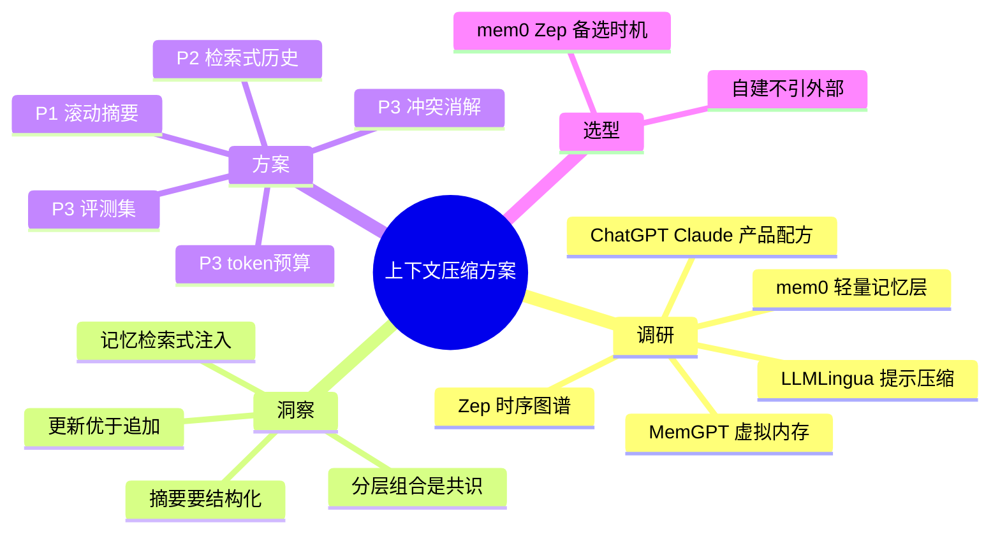

# 上下文压缩与记忆优化方案（调研 + 设计）

> 2026-09-21 · 调研范围：MemGPT/Letta、mem0、LangMem、Zep/Graphiti、LLMLingua、ChatGPT/Claude 产品实现、LongMemEval 评测基准

## 一、市场调研结论

### 1. 四类主流方案

| 类别 | 代表 | 核心思想 | 优势 | 代价 | LongMemEval* |
|---|---|---|---|---|---|
| **OS 式虚拟内存** | MemGPT/Letta | 把上下文当内存分页：主上下文放活跃内容，全量存外部（recall/archival memory），agent 自主换入换出、自编辑记忆 | 最完整，理论根基（arXiv 2023，1700+ 引用） | 运行时级侵入，重 | Letta 生态 |
| **轻量附加记忆层** | mem0 / LangMem | LLM 从对话提取事实 → 冲突消解（ADD/UPDATE/DELETE/NOOP）→ 向量+KV 存储，按需注入 | 轻、便宜、好集成 | 记忆质量一般 | mem0 ~49% |
| **时序知识图谱** | Zep/Graphiti | 实体-关系-时间三元组，支持时间推理与知识更新 | 时间推理强 | 复杂、占用大（每会话可超 60 万 token） | Zep ~63.8% |
| **产品级组合** | ChatGPT / Claude | 上下文内压缩（Claude auto-compact/context editing：临满自动摘要旧内容）+ 显式记忆（ChatGPT saved memories + reference chat history 检索旧对话；Claude MEMORY.md + 跨会话搜索） | 工程平衡的实战配方 | — | — |

*LongMemEval（Wu et al. 2024，650+ 引用）：业界记忆能力基准，考察信息提取/多会话推理/时间推理/知识更新/弃答五能力。数字来自 vectorize.io 2026-03 对比（Hindsight 94.6% 为参照上限）。

### 2. 压缩技术（与记忆正交）

- **token 级提示压缩**（LLMLingua-2，微软）：小模型蒸馏学习删 token，最高 20x。适合**长静态提示**（RAG 检索上下文、长文档），对动态对话收益有限。
- **对话压实（compaction）配方**：业界共识是组合拳——**截断（保最近）+ 滚动摘要（保脉络）+ 结构化状态（保关键事实）+ 按需检索（保细节）**，四者各管一段。

### 3. 关键洞察（直接指导我们）

1. **头部产品都走"分层组合"而非单一技术**——压缩在上下文内做（摘要），记忆在上下文外做（提取+检索注入）。
2. **记忆是检索式按需注入，不是全量塞入**（ChatGPT reference chat history、mem0 的向量召回）。
3. **知识更新比知识追加重要**（LongMemEval 单列能力；mem0 的冲突消解管线）：用户换部门了，旧记忆必须能被更新/失效。
4. **摘要要结构化**：事实/决定/待办/偏好分项保留，比纯散文摘要可召回性好。

## 二、本项目现状对照

| 能力 | 现状 | 差距 |
|---|---|---|
| 短期记忆 | ✅ 滑动窗口（10条/8000字符，旧的直接丢） | ❌ 丢弃即失忆，无滚动摘要 |
| 长期记忆 | ✅ 用户长期蒸馏 + 全局记忆，去重、版本、缓存联动 | ❌ 只增不改：新旧事实冲突时无更新/失效（无 ADD/UPDATE/DELETE 消解） |
| 检索式历史 | ❌ 无 | ❌ 历史轮次未向量化，无法按当前问题召回相关旧对话 |
| 上下文预算 | 字符制拍脑袋值 | ❌ 无 token 级预算分配 |
| 提示压缩 | ❌ 无 | RAG 上下文可用 LLMLingua-2 类方案（优先级低） |
| 记忆评测 | ❌ 无 | ❌ 无 LongMemEval 式回归集 |

## 三、优化方案（三阶段）

**选型前提**：不引入 mem0/Letta/Zep 外部依赖——我们已有 pgvector + Redis + LLM 蒸馏全套积木，自建三层已覆盖 mem0 核心能力；Letta 是运行时级侵入，Zep 复杂度不成比例。**何时换外部方案**：多租户大规模、需要跨语言/托管记忆服务、或自建维护成本超过集成成本时，优先评估 mem0（轻）→ Zep（需时间推理）。

### P1：滚动摘要 + 分级注入（核心缺口，一次会话可落地）

**机制**：
- `chat_sessions` 加 `summary TEXT` 与 `summary_upto_id BIGINT`（已摘要到哪条消息）。
- `_trim_history` 丢弃旧轮次时**不再直接丢**：把被裁掉的轮次增量摘要合并进会话摘要（复用现有 `generate_text`；摘要 prompt 要求结构化输出：事实/决定/待办/偏好四栏）。
- 注入分级（消息序）：`system(+RAG上下文) → 记忆块（全局/用户长期） → [会话摘要] → 最近 K 轮原文 → 当前问题`。
- 摘要变更进缓存键（复用 memory_version 机制，新增 summary_version 或并入 memory version）。

**配置**：`CHAT_SUMMARY_ENABLED=true`、`CHAT_SUMMARY_TRIGGER_MESSAGES=10`（超出窗口才触发）、`CHAT_SUMMARY_MAX_CHARS=1500`。

**验收**：多轮长对话后，第 15 轮仍能回答第 2 轮的细节问题（摘要携带）；mock 增加摘要模式回显。

### P2：检索式历史（mem0/ChatGPT reference 风格）

**机制**：
- `chat_messages` 向量化入 pgvector（新表 `message_embeddings`，或复用 embedding 管线；异步写入，与蒸馏同批）。
- 提问时用当前问题 embedding 检索 top-k（3~5）相关历史轮次，去重掉已在窗口内的，作为 `[相关历史片段]` 注入。
- 摘要管"全局脉络"，检索管"具体细节"，互补。
- 缓存策略：带检索历史注入的问答照旧跳过缓存（与会话历史同策略）。

**验收**：跨 20+ 轮的"我们之前讨论的 X 具体是什么"类问题可命中旧轮次原文。

### P3：记忆质量升级（消解 + 评测 + 预算）

1. **冲突消解**：蒸馏管线升级——新提取事实与同 scope 语义相近（cosine ≥0.85）的旧记忆比对，LLM 分类 ADD/UPDATE/DELETE/NOOP，替代"只增不改"。这是 LongMemEval"知识更新"能力的直接对应。
2. **记忆回归评测**：建小型 LongMemEval 式自测集（20~30 题：跨会话事实/时间推理/知识更新/弃答），脚本化跑分进 CI，防止记忆改动退化。
3. **token 预算**：按模型 maxTokens 给 system/RAG/记忆/摘要/窗口分档（如 15%/30%/10%/15%/30%），字符预算改为 token 预算的近似换算。

### 优先级与节奏

| 阶段 | 价值 | 工作量 | 建议 |
|---|---|---|---|
| P1 滚动摘要 | 高（补最大失忆缺口） | 小（动 `_trim_history` + session 表 + 注入序） | **立即做** |
| P2 检索式历史 | 中高（长对话细节召回） | 中（向量化管线 + 检索注入） | P1 后做 |
| P3.1 冲突消解 | 高（记忆正确性） | 中 | P2 后做 |
| P3.2 评测集 | 高（防退化） | 中 | 与 P3.1 同期 |
| P3.3 token 预算 | 低（当前未触顶） | 小 | 择机 |
| LLMLingua 接入 | 低（RAG 上下文目前不长） | 中 | 暂缓 |

## 四、思维导图

