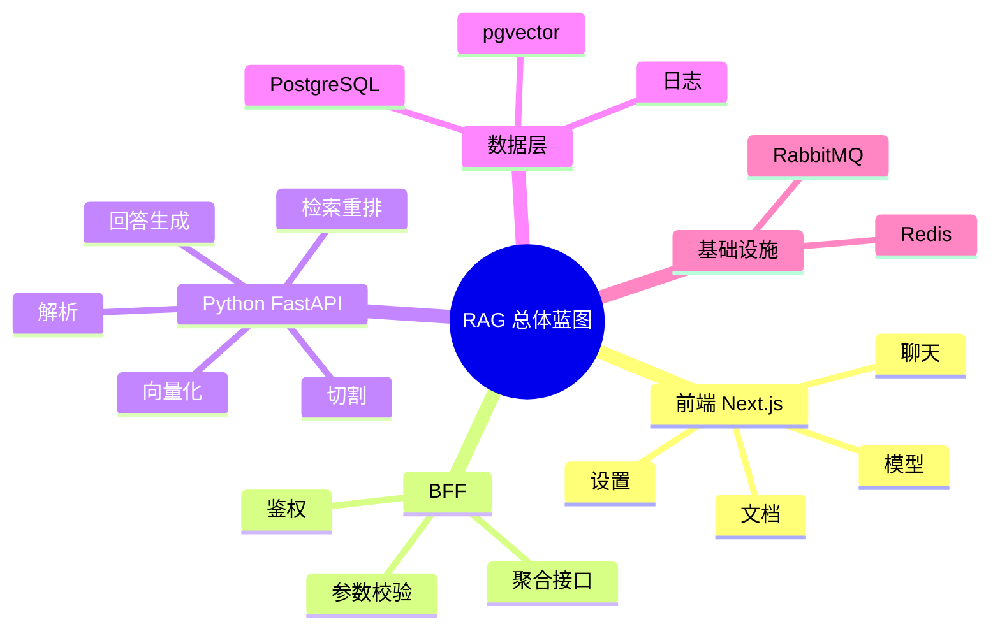

# RAG 总体蓝图（Next.js + Python）

## 1. 一句话目标

做一套企业知识问答系统：上传文档后可检索证据，聊天返回答案时能带引用来源。

## 2. 总体分层

1. 前端层（Next.js + React + TS）
   - 聊天页、文档页、模型页、设置页。
   - 通过 API Route/Server Action 对接后端服务。
2. 应用编排层（Next.js BFF）
   - 聚合请求、做鉴权、做轻量缓存和参数校验。
3. AI 服务层（Python FastAPI）
   - 文档解析、切割、向量化、检索、重排、答案生成。
4. 数据层（PostgreSQL + pgvector）
   - 存文档、chunk、embedding、会话记录、检索日志。
5. 基础设施（Redis + RabbitMQ）
   - Redis 缓存热点问答与状态。
   - RabbitMQ 承担异步任务链。

## 3. 核心链路

### 3.1 上传链路

上传 -> 入队 -> 解析 -> 切割 -> 向量化 -> 入库 -> 可检索

### 3.2 问答链路

提问 -> 改写 -> 检索 -> 重排 -> 生成 -> 返回答案+引用

## 4. 关键决策

- Next.js 负责 UI 和对外接口，Python 负责 AI 重活，职责清楚。
- 首版必须支持流式输出和引用来源，不做纯黑盒回答。
- 首版先内网单租户，后续再加多租户和细粒度权限。

## 5. 思维导图

