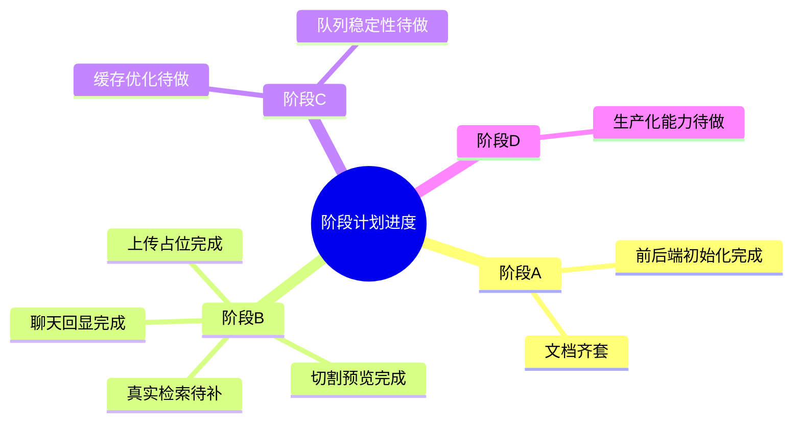

# 阶段计划（Next.js + Python RAG）

## 阶段 A：骨架期（2-3 天）

目标：工程能跑、文档齐、接口契约清楚。

交付：
- [x] Next.js 工程初始化
- [x] FastAPI 工程初始化
- [x] 文档总览 + 架构图 + 接口草案
- [x] 前端 4 页面骨架（聊天/文档/模型/设置）
- [x] 前端 BFF 代理链路（Next -> FastAPI）

验收：
- [x] 前后端都能启动
- [x] docs 可指导开发

## 阶段 B：MVP 闭环（1-2 周）

目标：上传文档后能问答并看到引用。

交付：
- [x] 文档上传入队占位接口
- [x] 文档切割实时预览基础版
- [x] 聊天提问接口（当前为回显，占位）
- [x] 模型管理列表与聊天模型限制
- [ ] 检索+重排+生成真实链路
- [ ] 聊天流式 SSE 输出

验收：
- [ ] 全链路可跑通（真实向量检索）
- [ ] 能返回可读答案和引用（真实来源）

## 阶段 C：优化期（1 周）

目标：更准、更快、更稳。

交付：
- [ ] Redis 缓存命中优化
- [ ] 检索重排优化
- [ ] RabbitMQ 重试和死信

验收：
- [ ] 延迟下降
- [ ] 错误率可控

## 阶段 D：生产化（1-2 周）

目标：具备上线能力。

交付：
- [ ] 权限审计
- [ ] 监控告警
- [ ] 压测与回滚预案

验收：
- [ ] 可稳定运行
- [ ] 故障可追踪可恢复

## 当前思考

- 主链路已经有“页面 + API + FastAPI”可运行雏形，下一步优先补真实检索。
- 切割预览提前做出来，后续调 chunk 参数更直观。
- 聊天模型限制已落地，能避免把 embedding 模型选成聊天模型。

## 思维导图

