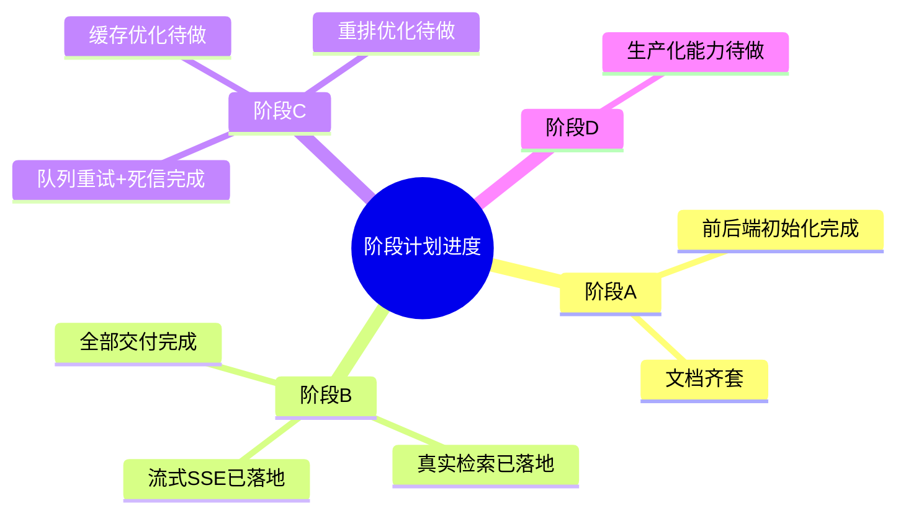

# 阶段计划（Next.js + Python RAG）

## 阶段 A：骨架期（2-3 天）

目标：工程能跑、文档齐、接口契约清楚。

交付：
- [x] Next.js 工程初始化
- [x] FastAPI 工程初始化
- [x] 文档总览 + 架构图 + 接口草案
- [x] 前端 4 页面骨架（聊天/文档/模型/设置）
- [x] 前端 BFF 代理链路（Next -> FastAPI）

验收：
- [x] 前后端都能启动
- [x] docs 可指导开发

## 阶段 B：MVP 闭环（1-2 周）

目标：上传文档后能问答并看到引用。

交付：
- [x] 文档上传入队占位接口
- [x] 文档切割实时预览基础版
- [x] 聊天提问接口（当前为回显，占位）
- [x] 模型管理列表与聊天模型限制
- [x] 检索+重排+生成真实链路（父召回子精排，2026-03-01 落地）
- [x] 聊天流式 SSE 输出（2026-03-01 落地）

验收：
- [x] 全链路可跑通（真实向量检索）
- [x] 能返回可读答案和引用（真实来源）

## 阶段 C：优化期（1 周）

目标：更准、更快、更稳。

交付：
- [ ] Redis 缓存命中优化（热点问答缓存尚未接入 rag_service）
- [ ] 检索重排优化
- [x] RabbitMQ 重试和死信（2026-09-16 落地：分档延迟重试 + DLQ + 重播/清空接口 + 前端死信管理）

验收：
- [ ] 延迟下降
- [x] 错误率可控（任务失败可重试、可兜底、可恢复，不丢消息）

## 阶段 D：生产化（1-2 周）

目标：具备上线能力。

交付：
- [ ] 权限审计
- [ ] 监控告警
- [ ] 压测与回滚预案

验收：
- [ ] 可稳定运行
- [ ] 故障可追踪可恢复（死信重播已具备恢复手段，追踪能力待监控告警补齐）

## 当前思考

- 队列稳定性已闭环：瞬断自动延迟重试（5s/30s/120s 可配），业务性失败不浪费重试直接进死信，死信支持查看/重播/清空。
- 下一步优先做 Redis 缓存命中优化：rag_service 目前完全没有缓存层，热点问答直连 DB+向量检索。
- 检索重排优化依赖真实语料压测，建议在缓存落地后一起做延迟基线。

## 思维导图

```mermaid
mindmap
  root((阶段计划进度))
    阶段A
      前后端初始化完成
      文档齐套
    阶段B
      全部交付完成
      真实检索已落地
      流式SSE已落地
    阶段C
      队列重试+死信完成
      缓存优化待做
      重排优化待做
    阶段D
      生产化能力待做
```
