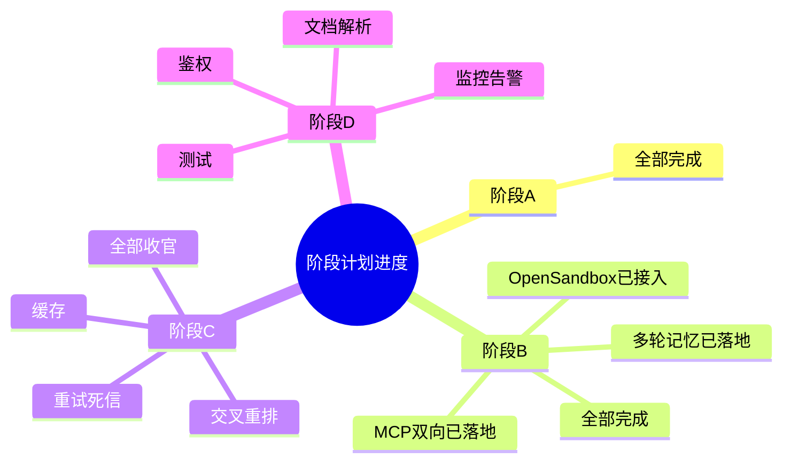

# 阶段计划（Next.js + Python RAG）

## 阶段 A：骨架期（2-3 天）

目标：工程能跑、文档齐、接口契约清楚。

交付：
- [x] Next.js 工程初始化
- [x] FastAPI 工程初始化
- [x] 文档总览 + 架构图 + 接口草案
- [x] 前端 4 页面骨架（聊天/文档/模型/设置）
- [x] 前端 BFF 代理链路（Next -> FastAPI）

验收：
- [x] 前后端都能启动
- [x] docs 可指导开发

## 阶段 B：MVP 闭环（1-2 周）

目标：上传文档后能问答并看到引用。

交付：
- [x] 文档上传入队占位接口
- [x] 文档切割实时预览基础版
- [x] 聊天提问接口（当前为回显，占位）
- [x] 模型管理列表与聊天模型限制
- [x] 检索+重排+生成真实链路（父召回子精排，2026-03-01 落地）
- [x] 聊天流式 SSE 输出（2026-03-01 落地）
- [x] 多轮对话记忆（2026-09-17 落地：历史注入 + 追问改写 + 非流式消息持久化）
- [x] 接入阿里 OpenSandbox 代码沙盒（2026-09-17 落地：mcp.sandbox.execute 内置工具，禁网限资源，代码块自动执行）
- [x] MCP 双向能力（2026-09-17 落地：标准协议接入外部 MCP Server + /mcp 自暴露知识库工具 + invoke API + 聊天 externalTools）

验收：
- [x] 全链路可跑通（真实向量检索）
- [x] 能返回可读答案和引用（真实来源）

## 阶段 C：优化期（1 周）

目标：更准、更快、更稳。

交付：
- [x] Redis 缓存命中优化（2026-09-16 落地：Redis 精确命中 + pgvector 语义命中 + kb 版本失效，实测精确命中约 200 倍提速）
- [x] 检索重排优化（2026-09-17 落地：向量召回×4 + bge-reranker 交叉精排，失败降级向量序，order_changed 可观测）
- [x] RabbitMQ 重试和死信（2026-09-16 落地：分档延迟重试 + DLQ + 重播/清空接口 + 前端死信管理）

验收：
- [x] 延迟下降（缓存命中 834ms → 4ms，mock 800ms LLM 延迟场景）
- [x] 错误率可控（任务失败可重试、可兜底、可恢复，不丢消息；重排失败降级不中断检索）

## 阶段 D：生产化（1-2 周）

目标：具备上线能力。

交付：
- [ ] 权限审计
- [ ] 监控告警
- [ ] 压测与回滚预案

验收：
- [ ] 可稳定运行
- [ ] 故障可追踪可恢复（死信重播已具备恢复手段，追踪能力待监控告警补齐）

## 当前思考

- **阶段 C 全部收官**（2026-09-17）：缓存（精确+语义）、队列可靠性（重试+死信）、交叉重排均已落地并实测。
- 2026-09-20 前端升级（聊天页 Markdown 渲染/引用角标/MCP 工具多选）与多格式文档解析（PDF/Word/HTML）落地。
- 阶段 D 剩余按优先级：鉴权（API 层零认证是最大欠账）> 测试（目前零测试）> 监控告警（可复用 retrieval_logs / mcp_skill_logs / tool_runs 数据面）。
- 真实模型接入后可再做：LLM 自动决策调用 MCP 工具（当前为关键词路由+显式点名）、RAG 质量评估集。

## 思维导图

```mermaid
mindmap
  root((阶段计划进度))
    阶段A
      全部完成
    阶段B
      全部完成
      多轮记忆已落地
      MCP双向已落地
      OpenSandbox已接入
    阶段C
      全部收官
      缓存
      重试死信
      交叉重排
    阶段D
      鉴权
      测试
      文档解析
      监控告警
```
